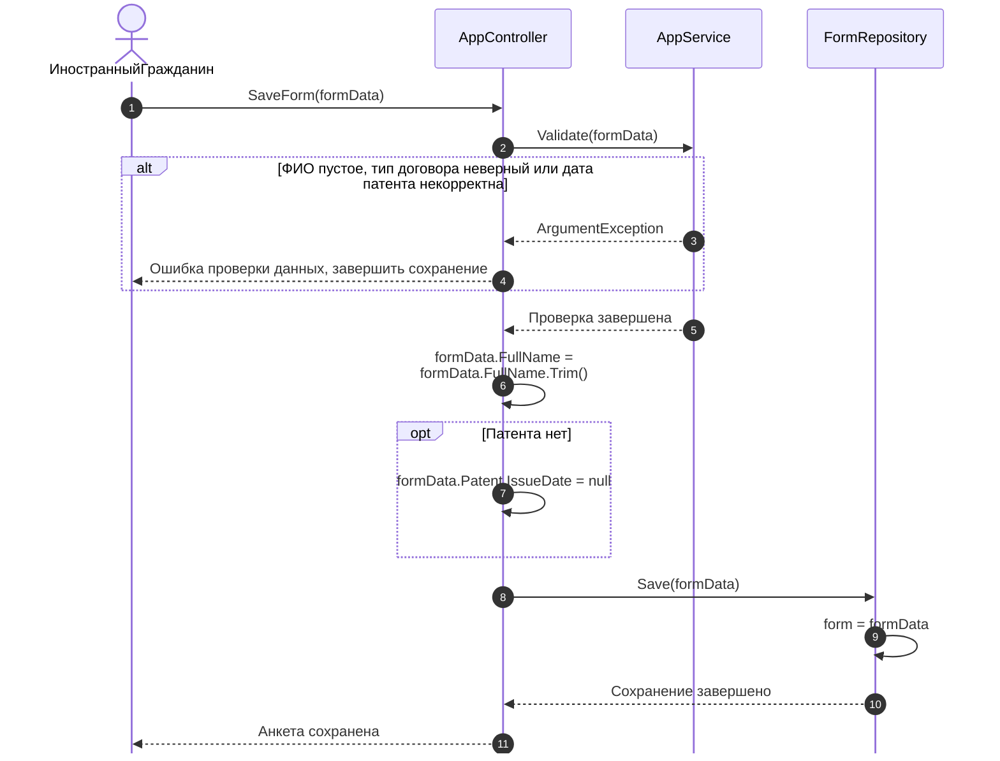
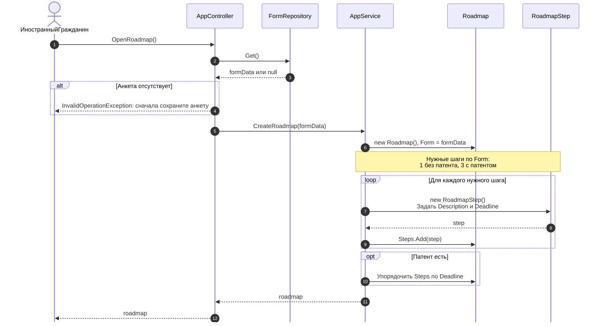

# Диаграмма последовательностей системных функций.

## Ввести данные

```mermaid
%%{init: {'sequence': {'mirrorActors': false}}}%%
sequenceDiagram
    autonumber
    actor ИностранныйГражданин
    participant AppController
    participant AppService
    participant FormRepository
    ИностранныйГражданин->>AppController: SaveForm(formData)
    AppController->>AppService: Validate(formData)

    alt ФИО пустое, тип договора неверный или дата патента некорректна
        AppService-->>AppController: ArgumentException
        AppController-->>ИностранныйГражданин: Ошибка проверки данных, завершить сохранение
    end

    AppService-->>AppController: Проверка завершена
    AppController->>AppController: formData.FullName =<br/>formData.FullName.Trim()
    opt Патента нет
        AppController->>AppController: formData.Patent.IssueDate = null
    end
    AppController->>FormRepository: Save(formData)
    FormRepository->>FormRepository: form = formData
    FormRepository-->>AppController: Сохранение завершено
    AppController-->>ИностранныйГражданин: Анкета сохранена
```

## Открыть дорожную карту

```mermaid
%%{init: {'sequence': {'mirrorActors': false}}}%%
sequenceDiagram
    autonumber
    actor ИностранныйГражданин
    participant AppController
    participant FormRepository
    participant AppService
    participant Roadmap
    participant RoadmapStep
    ИностранныйГражданин->>AppController: OpenRoadmap()
    AppController->>FormRepository: Get()
    FormRepository-->>AppController: formData или null

    alt Анкета отсутствует
        AppController-->>ИностранныйГражданин: InvalidOperationException: сначала сохраните анкету
    end

    AppController->>AppService: CreateRoadmap(formData)
    AppService->>Roadmap: new Roadmap(), Form = formData
    Note over AppService,RoadmapStep: Нужные шаги по Form:<br/>1 без патента, 3 с патентом
    loop Для каждого нужного шага
        AppService->>RoadmapStep: new RoadmapStep()<br/>Задать Description и Deadline
        RoadmapStep-->>AppService: step
        AppService->>Roadmap: Steps.Add(step)
    end
    opt Патент есть
        AppService->>Roadmap: Упорядочить Steps по Deadline
    end
    AppService-->>AppController: roadmap
    AppController-->>ИностранныйГражданин: roadmap
```
