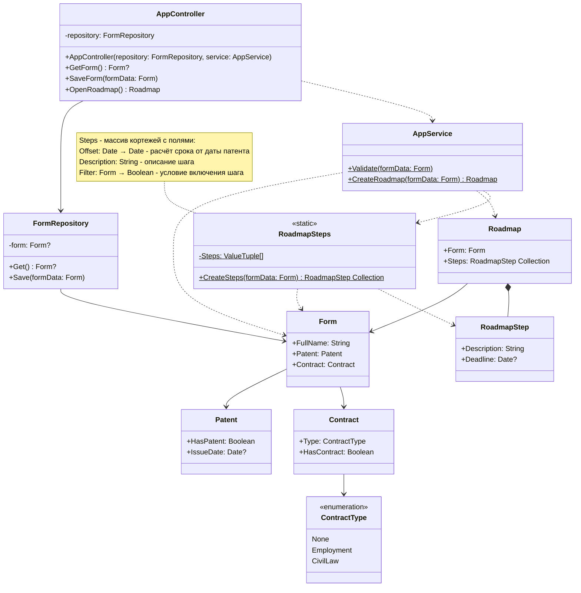

# Создание диаграмм классов проектирования

```mermaid
classDiagram
    direction TB

    class AppController {
        -repository: FormRepository
        +AppController(repository: FormRepository, service: AppService)
        +GetForm() Form?
        +SaveForm(formData: Form)
        +OpenRoadmap() Roadmap
    }

    class AppService {
        +Validate(formData: Form)$
        +CreateRoadmap(formData: Form) Roadmap$
    }

    class FormRepository {
        -form: Form?
        +Get() Form?
        +Save(formData: Form)
    }

    class Form {
        +FullName: String
        +Patent: Patent
        +Contract: Contract
    }

    class Patent {
        +HasPatent: Boolean
        +IssueDate: Date?
    }

    class Contract {
        +Type: ContractType
        +HasContract: Boolean
    }

    class ContractType {
        <<enumeration>>
        None
        Employment
        CivilLaw
    }

    class Roadmap {
        +Form: Form
        +Steps: RoadmapStep Collection
    }

    class RoadmapSteps {
        <<static>>
        -Steps: ValueTuple[]$
        +CreateSteps(formData: Form) RoadmapStep Collection$
    }

    note for RoadmapSteps "Steps - массив кортежей с полями:<br/>Offset: Date → Date - расчёт срока от даты патента<br/>Description: String - описание шага<br/>Filter: Form → Boolean - условие включения шага"

    class RoadmapStep {
        +Description: String
        +Deadline: Date?
    }


    AppController --> FormRepository
    AppController ..> AppService
    AppService ..> Form
    AppService ..> Roadmap
    AppService ..> RoadmapSteps
    RoadmapSteps ..> Form
    RoadmapSteps ..> RoadmapStep

    FormRepository --> Form
    Form --> Patent
    Form --> Contract
    Contract --> ContractType
    Roadmap --> Form
    Roadmap *-- RoadmapStep
```
